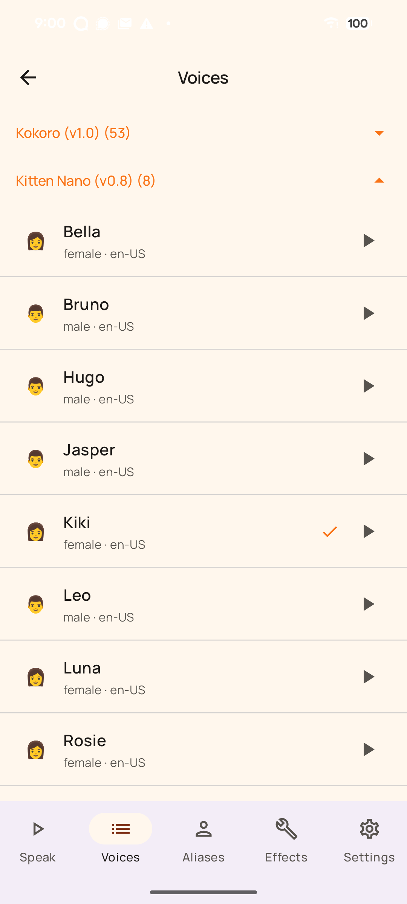

  

<h1 align="center">Marmalade TTS</h1>

  <a href="https://github.com/maxwhipw/marmalade-tts">🍊 marmalade-tts — the Linux CLI this grew from</a>

  <b>Human-sounding text-to-speech for Android, running entirely on your phone.</b>

  
  &nbsp;
  &nbsp;
  &nbsp;

---

Android text-to-speech is usually a choice between Google's data-hungry
default and robotic FOSS engines. **Marmalade is the missing middle: neural
voices that actually sound human, with zero cloud.** It installs as a system
TTS engine, so every app that reads text aloud — your screen reader,
e-reader, podcast client, AI chat — speaks through it. No accounts, no
tracking, no network calls during synthesis. Ever.

## Features

- **System-wide engine.** Implements Android's `TextToSpeechService` — a drop-in replacement for Google/Samsung TTS across every app on the device.
- **Neural voices, on-device.** Pick from **Kokoro** (53 voices, 9 languages), **Kitten** (tiny + fast, runs anywhere), and **Pocket** (the most expressive English). All run locally on ONNX Runtime — synthesis never leaves the phone.
- **Voice personas.** Save aliases pairing a voice with a speed and an effects chain, then route individual apps to the persona you want them to use.
- **A real audio-effects rack.** A pure-Kotlin DSP chain — reverb, telephone, robot, bitcrush, ring-mod and more — stackable and previewable per persona.
- **Built for long-form.** Batch synthesis, a foreground media-playback service with lock-screen controls, a share-sheet target, and a Quick Settings tile that speaks your clipboard.
- **Genuinely offline.** The one and only network use is the optional, one-time download of the engines you choose.

## Screenshots

  
  &nbsp;
  &nbsp;

## Install

Store listings (Google Play and F-Droid) are in progress — see
[docs/release/DISTRIBUTION-GAMEPLAN.md](docs/release/DISTRIBUTION-GAMEPLAN.md).
Until they land (and forever after, for sideloaders):

- **[GitHub Releases](https://github.com/maxwhipw/marmalade-tts-android/releases)** —
  grab the latest `fdroid`-flavor APK (every feature unlocked, no
  billing code) and install it.
- **[Obtainium](https://github.com/ImranR98/Obtainium)** — add
  `https://github.com/maxwhipw/marmalade-tts-android` as an app source
  and you'll get updates automatically as new versions are tagged.

After installing, enable it as the system voice under **Android
Settings → Accessibility → Text-to-speech output → Preferred engine**
(path varies slightly by device).

## Installing engines

Marmalade ships small — the APK bundles no model files. On first launch you
pick which engines to install; each downloads from a hostname pinned in the
catalog into app-private storage. Add or remove engines anytime from
**Settings → Engines**. The `INTERNET` permission is used solely for these
downloads — see [PRIVACY.md](PRIVACY.md).

## License

Source files are **MIT**. The released APK compiles in **espeak-ng**
(GPL-3.0-or-later, built from source out of the pinned
`third_party/espeak-ng` submodule), so the **distributed APK is a
GPL-3.0-or-later combined work** — required by Google Play, which forbids
downloading executable code at runtime. Engine downloads carry models and
phonemizer data only. Every third-party license is browsable inside the
app at **Settings → About → Open-source licenses**, and in
[NOTICE.md](NOTICE.md) / [LICENSES/](LICENSES/).

## Related projects

- **[marmalade-tts](https://github.com/maxwhipw/marmalade-tts)** — the Linux CLI ancestor: daemon mode, scripting-first, multi-engine.
- **[marmalade-android](https://github.com/maxwhipw/marmalade-android)** — the OpenClaw AI assistant client it shares its mascot and visual language with.
