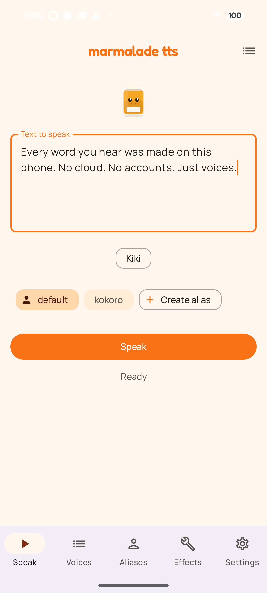
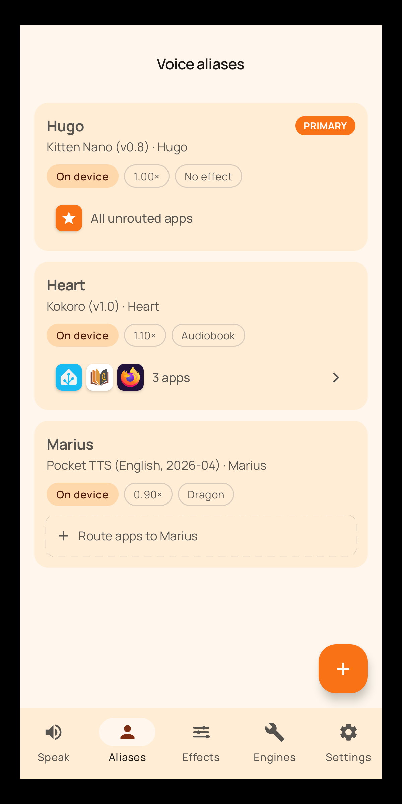
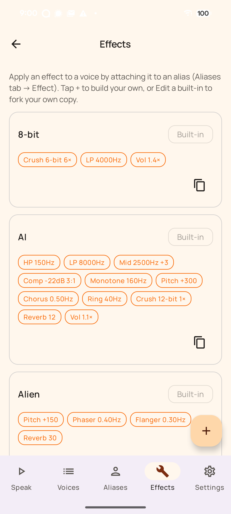

  

<h1 align="center">Marmalade TTS</h1>

  <a href="https://github.com/maxwhipw/marmalade-tts">🍊 marmalade-tts — the Linux CLI this grew from</a>

  <b>Fast, natural, private text-to-speech for your whole phone. Works offline.</b>

  
  &nbsp;
  &nbsp;
  &nbsp;

---

Marmalade TTS gives your phone a voice worth listening to. Set it as your
system text-to-speech engine and every app that reads aloud, from screen
readers to e-readers to chat apps, speaks through Marmalade. Android TTS is
usually a choice between Google's data-hungry default and robotic FOSS
engines; Marmalade is the missing middle: neural voices that actually sound
human, private by default.

## Features

- **Natural neural voices.** Ready to speak the moment you install
- **Fast.** Speech responds quickly even on modest phones
- **Private by default.** Everything runs on your device
- **Optional cloud voices.** From private third parties with your own API key (Venice.ai)
- **Per app voices.** Route each app to its own voice
- **Speaks 8 languages.** Auto detects what language is being read on the Kokoro TTS engine
- **Accessible.** TalkBack supported and designed to meet WCAG 2.1 AA
- **Voice effects.** 22 voice effect presets plus an editor to make your own
- **Free, open source, no ads, no accounts**

Marmalade implements Android's standard text-to-speech interface, so it is a
drop-in replacement for Google or Samsung TTS. Aliases tie a voice to speed
and effect settings; route apps to aliases and your e-reader can speak in one
voice while your chat app uses another. A foreground playback service reads
long text reliably with the screen off, with lock-screen and Bluetooth
controls, and you can share text from any app, use the system "read
selection" action, or speak your clipboard from a Quick Settings tile.

## Screenshots

  
  &nbsp;
  &nbsp;

## Install

Store listings (Google Play and F-Droid) are in progress. Until they
land (and forever after, for sideloaders):

- **[GitHub Releases](https://github.com/maxwhipw/marmalade-tts-android/releases)** —
  grab the latest `fdroid`-flavor APK (every feature unlocked, no
  billing code) and install it.
- **[Obtainium](https://github.com/ImranR98/Obtainium)** — add
  `https://github.com/maxwhipw/marmalade-tts-android` as an app source
  and you'll get updates automatically as new versions are tagged.

After installing, enable it as the system voice under **Android
Settings → Accessibility → Text-to-speech output → Preferred engine**
(path varies slightly by device).

## Engines

A fast English voice (Kitten Nano) is built into the APK, so Marmalade
speaks offline from the first launch. Bigger and better engines download
on demand from hostnames pinned in the catalog into app-private storage;
add or remove them anytime from the **Engines** tab. Cloud voices are
strictly opt-in: add your own API key for a provider (Venice.ai and
OpenAI ship in the list) and mind that only the provider you configure
ever sees your text. Details in [PRIVACY.md](PRIVACY.md).

## License

Source files are **MIT**; the repository contains no GPL code. The
released APK compiles in **espeak-ng** (GPL-3.0-or-later, built from
source out of the pinned `third_party/espeak-ng` submodule), so the
**distributed APK is a GPL-3.0-or-later combined work** — required by
Google Play, which forbids downloading executable code at runtime.
Engine downloads carry models and phonemizer data only. Every
third-party license is browsable inside the app at **Settings → About →
Open-source licenses**, and in [NOTICE.md](NOTICE.md) /
[LICENSES/](LICENSES/).

## Related projects

- **[marmalade-tts](https://github.com/maxwhipw/marmalade-tts)** — the Linux CLI ancestor: daemon mode, scripting-first, multi-engine.
- **[marmalade-android](https://github.com/maxwhipw/marmalade-android)** — the OpenClaw AI assistant client it shares its mascot and visual language with.
